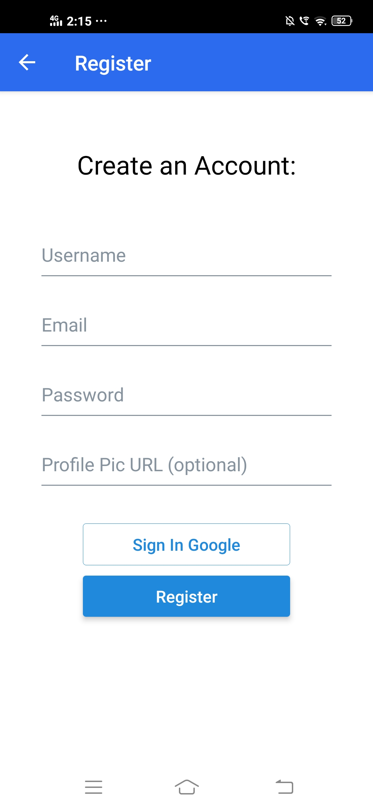
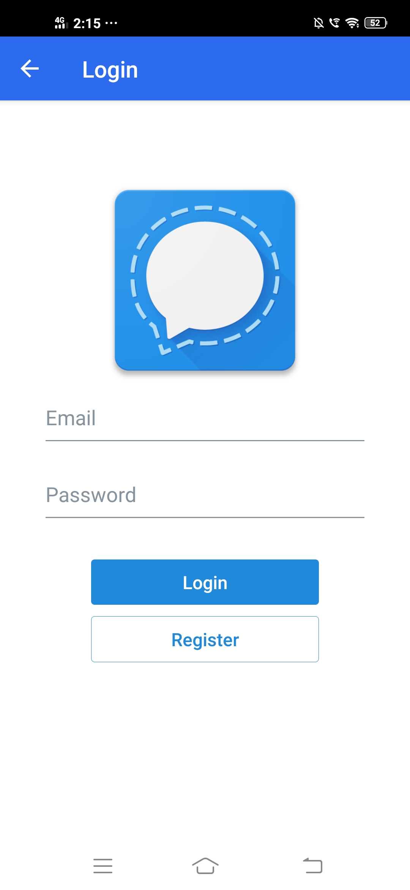
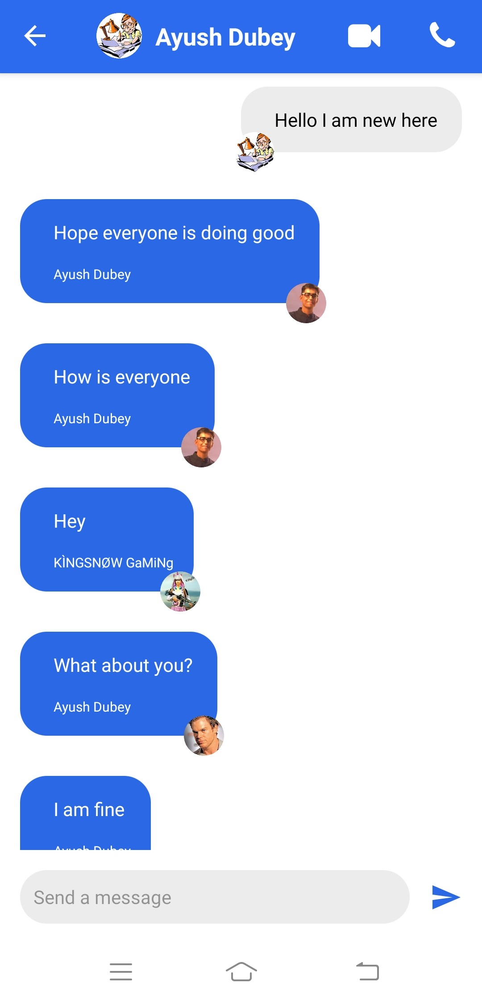

# Chat-App-react (Mobile-App)
This is a realtime chat application built using react-native and firebase database.

> ## Creating an Expo-React-Native App: 
`npx create-react-native-app --template`

> ### Packages to be installed:
> `npm install`:
 "@react-navigation/native": "^5.9.2"
 "@react-navigation/stack": "^5.14.2"
 "expo-google-app-auth": "^8.1.4"     // For Google Authentication.
 "expo-status-bar": "~1.0.3"
 "firebase": "7.9.0"
 "react-google-button": "^0.7.2"
